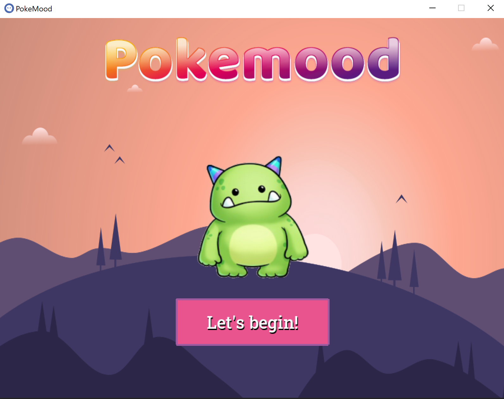
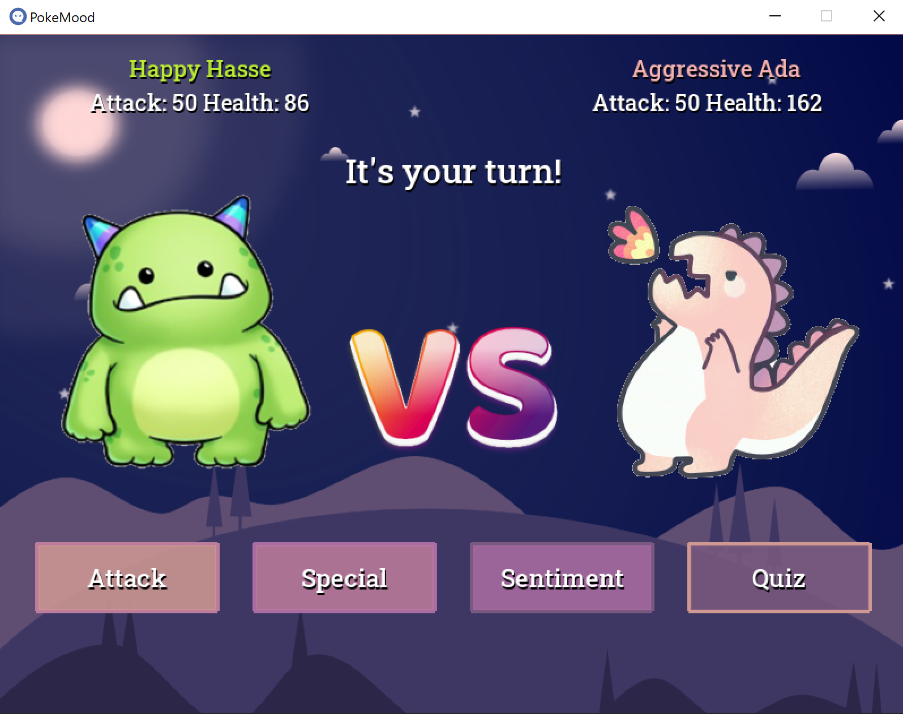
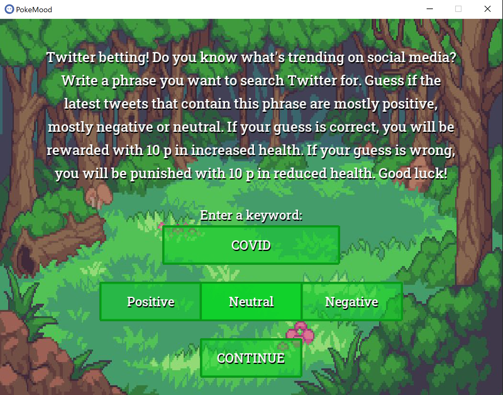
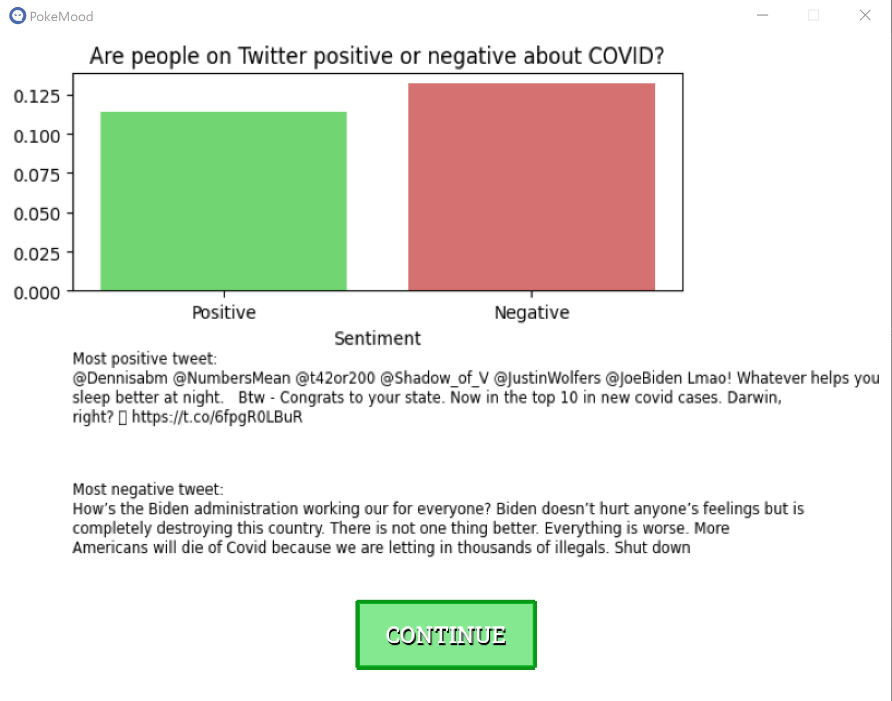
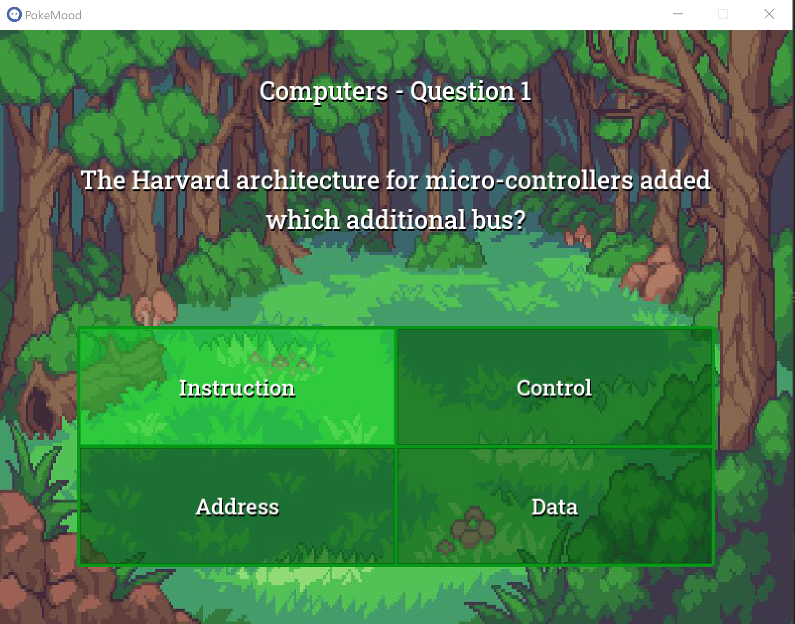

# Pokemood  

### Team members: Lunnahaxx, MarDrugge, SimonStarling, SophieN12, stinisson

VADER: A Parsimonious Rule-based Model for Sentiment Analysis of Social Media Text
(by C.J. Hutto and Eric Gilbert)
Eighth International Conference on Weblogs and Social Media (ICWSM-14). Ann Arbor, MI, June 2014.

[Swedish-translated VADER-Sentiment-Analysis](https://pypi.org/project/vaderSentiment-swedish/ "Swedish-translated VADER-Sentiment-Analysis")

Quiz questions from [ Open Trivia DB](https://opentdb.com/ "Open Trivia DB - a free to use, user-contibuted trivia question database") - a free to use, user-contibuted trivia question database. 

Icon By [Andreuvv](https://commons.wikimedia.org/w/index.php?curid=90091768/ "Icon By Andreuvv - Own work") - Own work, CC BY-SA 4.0. 

